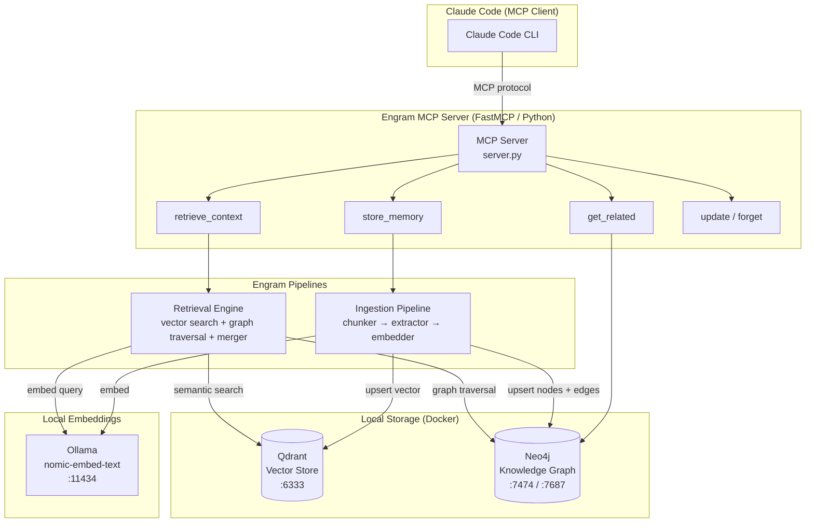
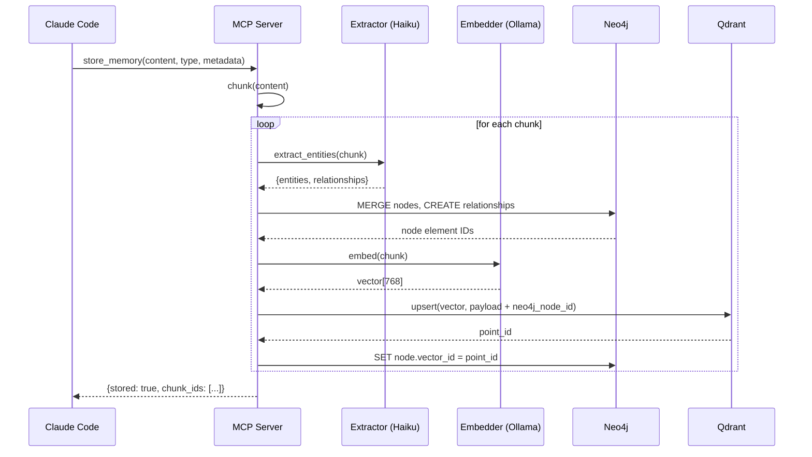
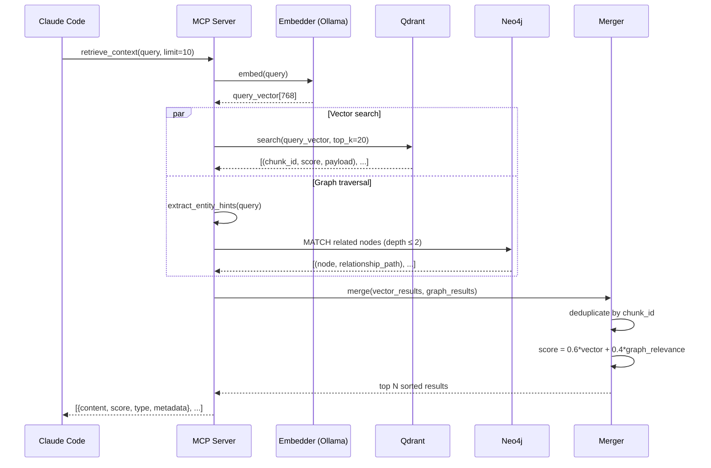

# Engram — Architecture

> *An engram is the physical trace a memory leaves in neural tissue. Engram gives Claude the same.*

This document is the living architectural record for **Engram**, a local-first hybrid memory backend for Claude Code (and eventually any LLM). It evolves alongside the project. Major decisions are recorded here with their rationale so future contributors — human and AI alike — understand not just *what* was built but *why*.

**Repository:** https://github.com/yoyoerx/engram
**Inspired by:** [The AI Amnesia Problem](https://medium.com/@yoyoerx/the-ai-amnesia-problem-architecting-long-term-memory-for-local-llms-cbe3d5c6c93e)
**Author:** [@yoyoerx](https://medium.com/@yoyoerx)
**Status:** MVP Complete
**Last Updated:** 2026-05-12

---

## Table of Contents

1. [Problem Statement](#1-problem-statement)
2. [Goals & Non-Goals](#2-goals--non-goals)
3. [System Diagram](#3-system-diagram)
4. [Core Components](#4-core-components)
5. [Data Stores](#5-data-stores)
6. [Memory Schema](#6-memory-schema)
7. [Data Flows](#7-data-flows)
8. [MCP Interface](#8-mcp-interface)
9. [Project Structure](#9-project-structure)
10. [Technology Decisions](#10-technology-decisions)
11. [Deployment & Infrastructure](#11-deployment--infrastructure)
12. [Security Considerations](#12-security-considerations)
13. [Development Phases](#13-development-phases)
14. [Migration Path](#14-migration-path)
15. [Future Considerations](#15-future-considerations)
16. [Open Questions](#16-open-questions)
17. [Glossary](#17-glossary)

---

## 1. Problem Statement

LLMs have fixed context windows. As conversations grow, earlier information is compressed or dropped entirely. The result is AI amnesia: the model forgets your preferences, past mistakes, ongoing projects, and the lessons learned from prior work.

Current workarounds (conversation summaries, flat-file memory dumps) are blunt instruments:
- Everything loads into context whether relevant or not, burning tokens on stale information.
- There is no semantic understanding of *what matters* for a given query.
- Relationships between memories are invisible — a bug fix and the architectural decision that caused it are stored as unrelated flat files.
- Memories accumulate without pruning, merging, or versioning.

Engram solves this by replacing load-everything retrieval with **query-driven hybrid retrieval**: semantic similarity (vector) combined with relationship traversal (knowledge graph), connected to Claude via MCP.

---

## 2. Goals & Non-Goals

### Goals
- **Local-first**: All data stays on the machine. No cloud dependencies for storage or embeddings.
- **Privacy-preserving**: Conversations and memories never leave the host system.
- **Hybrid retrieval**: Vector semantic search + knowledge graph traversal, merged and re-ranked.
- **Claude Code integration first**: MCP tools that work immediately with Claude Code's MCP support.
- **Living memory**: Memories update, merge, and get superseded — not just appended.
- **Provenance tracking**: Every memory knows its source (conversation ID, timestamp, memory type).
- **Migration-friendly**: Existing flat-file memories can be ingested.

### Non-Goals (v1)
- Real-time conversation interception (v1 requires explicit `store_memory` calls).
- Multi-user / multi-tenant support.
- Cloud sync or remote access.
- Supporting embedding models beyond Ollama-served ones.
- GUI or web dashboard (CLI and MCP tools only in v1).

---

## 3. System Diagram



---

## 4. Core Components

### 4.1 MCP Server (`engram_mcp/server.py`)
The entry point for Claude Code. Built with **FastMCP**, which reduces MCP server boilerplate to decorated Python functions. Listens on stdio (default MCP transport). Registers all tools and routes them to the appropriate pipeline.

> **Note on package naming:** The package is named `engram_mcp` (not `mcp`) to avoid shadowing the installed `mcp` library that FastMCP depends on. The `PYTHONPATH` env var is set when registering with Claude Code so the module is importable.

### 4.2 Ingestion Pipeline (`engram_mcp/ingest/`)
Processes raw text into both stores:
1. **Chunker** (`chunker.py`) — splits long content into semantically coherent chunks (sentence-aware, 512-char max, 64-char overlap).
2. **Extractor** (`extractor.py`) — calls Claude (`claude-haiku-4-5-20251001`, for cost) with a structured prompt to extract entity/relationship triples. Falls back to empty result on any error so ingestion is never blocked.
3. **Embedder** (`embedder.py`) — calls Ollama HTTP API to generate `nomic-embed-text` 768-dim embeddings.

> **Note:** Atomic rollback (Neo4j fails -> undo Qdrant write) is not yet implemented. This is tracked in Phase 7. In practice, partial writes leave orphan vectors without Neo4j nodes; a future reconciliation job can clean these up.

### 4.3 Retrieval Engine (`engram_mcp/search/`)
Runs vector and graph queries in parallel, merges results:
1. **Vector search** (`vector.py`) — queries Qdrant for top-K nearest neighbors by cosine similarity.
2. **Graph traversal** (`graph.py`) — extracts entity hints from the query using lightweight NER, then traverses Neo4j up to 2 hops.
3. **Merger** (`merger.py`) — deduplicates by `chunk_id`, computes combined score (`0.6 × vector_score + 0.4 × graph_relevance`), sorts descending, returns top N.

### 4.4 Schema Manager (`scripts/init_db.py`)
Applies Neo4j constraints (UNIQUE on `chunk_id` for Memory and other node types), fulltext index on `Memory.content`, and creates the Qdrant collection (`engram_memories`, 768-dim cosine) with payload indexes on `memory_type`, `project`, and `timestamp`. Run once at setup time.

### 4.5 Migration Tool (`scripts/migrate.py`)
Reads the existing flat-file memory directory (`~/.claude/projects/.../memory/*.md`), parses frontmatter, and ingests each file through the standard ingestion pipeline. One-way; flat files remain unchanged as fallback.

---

## 5. Data Stores

### Qdrant (Vector Store)
| Property | Value |
|---|---|
| Version | Latest stable |
| Transport | Docker, REST API |
| Port | 6333 (REST), 6334 (gRPC) |
| Collection | `engram_memories` |
| Embedding model | `nomic-embed-text` (768-dim) |
| Distance metric | Cosine similarity |
| Persistence | Docker volume `qdrant_data` |

Each vector point carries a payload:
```json
{
  "chunk_id": "uuid-v4",
  "content": "raw text of the chunk",
  "memory_type": "feedback | user | project | reference | decision | error",
  "project": "optional project name",
  "source_conversation": "optional conversation ID",
  "timestamp": "ISO-8601",
  "neo4j_node_id": "element ID in Neo4j for cross-reference"
}
```

### Neo4j Community (Knowledge Graph)
| Property | Value |
|---|---|
| Version | Latest Community stable |
| Transport | Docker, Bolt protocol |
| Ports | 7474 (browser UI), 7687 (Bolt) |
| Query language | Cypher |
| Persistence | Docker volume `neo4j_data` |

---

## 6. Memory Schema

### Node Labels

| Label | Description | Key Properties |
|---|---|---|
| `User` | Profile, preferences, expertise | `name`, `role`, `expertise[]` |
| `Project` | Ongoing work and context | `name`, `path`, `status`, `updated_at` |
| `Feedback` | Rules — corrections and confirmations | `rule`, `why`, `how_to_apply` |
| `Reference` | External resources and pointers | `url`, `description`, `system` |
| `Error` | Known mistakes and pitfalls | `description`, `cause`, `fix` |
| `Decision` | Architectural/design decisions | `description`, `rationale`, `alternatives[]` |
| `Concept` | Technical concepts and patterns | `name`, `definition` |
| `Tool` | Libraries, frameworks, CLIs | `name`, `version`, `purpose` |
| `Memory` | Generic container for a stored chunk | `chunk_id`, `content`, `type`, `timestamp` |

### Relationship Types

| Type | From → To | Meaning |
|---|---|---|
| `APPLIES_TO` | Feedback → Project | This rule is scoped to this project |
| `PREVENTS` | Feedback → Error | Following this rule avoids this error |
| `CAUSED_BY` | Error → Decision | This mistake stems from this choice |
| `USES` | Project → Tool | Project depends on this tool |
| `INVOLVES` | Memory → Project | This memory chunk is about this project |
| `SUPERSEDES` | Memory → Memory | Updated memory replaces an older one |
| `SIMILAR_TO` | Memory ↔ Memory | Cross-reference for near-duplicate memories |
| `LINKED_TO` | any → any | Generic association (fallback) |
| `ABOUT` | Memory → Concept\|Tool\|User | Chunk is about this entity |

### Entity Extraction Prompt (sent to claude-haiku-4-5)
```
Extract all entities and relationships from the following memory chunk.
Return ONLY a JSON object with this structure:
{
  "entities": [{"label": "<NodeLabel>", "name": "<canonical name>", "properties": {...}}],
  "relationships": [{"from": "<name>", "type": "<REL_TYPE>", "to": "<name>"}]
}
Use only the node labels and relationship types defined in the schema.
If unsure of a label, use "Concept". Do not fabricate relationships.

Memory chunk:
<chunk>
```

---

## 7. Data Flows

### 7.1 Ingestion Flow



### 7.2 Retrieval Flow



---

## 8. MCP Interface

Engram exposes these tools to Claude Code via MCP stdio transport.

### `store_memory`
```
Store a memory chunk to both vector store and knowledge graph.

Parameters:
  content       string   The memory text to store
  memory_type   enum     feedback | user | project | reference | decision | error
  project       string?  Project name to scope this memory (optional)
  metadata      object?  Additional key-value metadata (optional)

Returns:
  { stored: bool, chunk_ids: string[], entities_extracted: int }
```

### `retrieve_context`
```
Retrieve relevant memories using hybrid vector + graph search.

Parameters:
  query         string   Natural language query
  limit         int?     Max results to return (default: 10)
  memory_types  array?   Filter to specific types (default: all)
  project       string?  Scope search to a specific project (optional)

Returns:
  [{ chunk_id, content, score, memory_type, project, timestamp, metadata }]
```

### `get_related`
```
Traverse the knowledge graph from an entity.

Parameters:
  entity        string   Entity name to start from
  relationship  string?  Filter by relationship type (default: all)
  depth         int?     Max hops to traverse (default: 2, max: 3)

Returns:
  { entity, relationships: [{ type, target, properties }] }
```

### `update_memory`
```
Update an existing memory chunk (creates SUPERSEDES relationship).

Parameters:
  chunk_id      string   ID of the chunk to update
  content       string   New content
  metadata      object?  Updated metadata

Returns:
  { updated: bool, new_chunk_id: string }
```

### `forget`
```
Soft-delete a memory (tombstones it; does not hard-delete by default).

Parameters:
  chunk_id      string   ID of the chunk to forget
  hard          bool?    Permanently delete (default: false)

Returns:
  { forgotten: bool }
```

### `list_memories`
```
List stored memories with optional filters.

Parameters:
  memory_type   enum?    Filter by type
  project       string?  Filter by project
  limit         int?     Max results (default: 50)

Returns:
  [{ chunk_id, content_preview, memory_type, project, timestamp }]
```

---

## 9. Project Structure

```
engram/
├── architecture.md              # This document
├── docker-compose.yml           # Qdrant + Neo4j services
├── .env                         # Secrets (gitignored — see .env.example)
├── .env.example                 # Environment variable template
├── requirements.txt             # Python dependencies
│
├── engram_mcp/                  # MCP server package (named to avoid shadowing 'mcp' lib)
│   ├── server.py                # FastMCP entry point — registers all tools
│   ├── config.py                # Config (ports, model names, weights, memory types)
│   │
│   ├── ingest/                  # Ingestion pipeline
│   │   ├── __init__.py
│   │   ├── chunker.py           # Sentence-aware text splitter, 512-char/64-char overlap
│   │   ├── extractor.py         # Entity/relationship extraction via claude-haiku-4-5
│   │   └── embedder.py          # Ollama HTTP API client for nomic-embed-text embeddings
│   │
│   ├── search/                  # Retrieval engine
│   │   ├── __init__.py
│   │   ├── vector.py            # Qdrant query_points() logic
│   │   ├── graph.py             # Neo4j Cypher traversal + regex entity hint extraction
│   │   └── merger.py            # Result fusion, 60/40 scoring, deduplication
│   │
│   └── tools/                   # MCP tool implementations
│       ├── __init__.py
│       ├── store.py             # store_memory tool handler
│       ├── retrieve.py          # retrieve_context tool handler
│       ├── graph_tools.py       # get_related tool handler
│       └── manage.py            # update_memory, forget, list_memories
│
├── scripts/                     # Utility scripts
│   ├── init_db.py               # Apply Neo4j constraints + create Qdrant collection
│   ├── migrate.py               # Import from flat-file memory/*.md directory
│   ├── health_check.py          # Verify all four services are running
│   └── smoke_retrieve.py        # Quick retrieval sanity check
│
└── tests/
    ├── test_ingest.py           # Chunker, embedder, store_memory (15 tests, all passing)
    └── test_retrieve.py         # Merger unit tests + retrieve_context integration tests
```

---

## 10. Technology Decisions

### ADR-001: Qdrant over ChromaDB for vector storage
**Decision:** Use Qdrant.
**Rationale:** Qdrant has a built-in Web UI (port 6333/dashboard), REST + gRPC APIs, superior filtering capabilities on payload fields, and is actively maintained with a clear roadmap. ChromaDB is simpler to start but has had instability in embedded mode and weaker filtering. For a production-grade local system, Qdrant's operational maturity wins.
**Trade-off:** Qdrant requires Docker (or a binary install); ChromaDB can run fully in-process.

### ADR-002: Neo4j Community for the knowledge graph
**Decision:** Use Neo4j Community Edition (Docker).
**Rationale:** Industry-standard graph database with Cypher — a declarative, expressive query language. Excellent browser UI for inspecting the graph during development. Strong Python driver (`neo4j` package). Free for local use. The Community Edition limitation (single instance, no clustering) is fine for a local memory backend.
**Alternative considered:** ArangoDB (multi-model), TigerGraph (more complex setup). Neo4j's tooling and documentation ecosystem are unmatched.

### ADR-003: Ollama + nomic-embed-text for local embeddings
**Decision:** Use Ollama serving `nomic-embed-text`.
**Rationale:** `nomic-embed-text` (768-dim) consistently benchmarks near `text-embedding-3-small` on MTEB at zero cost and with full privacy. Ollama provides a simple HTTP API and handles model management. No OpenAI API key required; embeddings never leave the machine.
**Trade-off:** Requires Ollama installation (~500MB) + model download (~274MB first-run). Added once-only setup cost.

### ADR-004: FastMCP for the MCP server
**Decision:** Use the `fastmcp` Python package.
**Rationale:** FastMCP reduces MCP server boilerplate to `@mcp.tool()` decorators, making tool definitions readable and maintainable. The raw Anthropic MCP SDK requires significantly more ceremony. FastMCP is the community-standard simplification layer.

### ADR-005: claude-haiku-4-5 for entity extraction
**Decision:** Use claude-haiku-4-5 (not a local LLM) for entity/relationship extraction during ingestion.
**Rationale:** Entity extraction quality directly affects the knowledge graph's usefulness. Haiku is fast, cheap (~$0.0001/ingestion call), and reliably follows structured JSON schemas. A local LLM alternative (e.g., Ollama `mistral`) would be slower and less reliable at structured output.
**Trade-off:** Requires an Anthropic API key. Ingestion will fail without network access. Future option: add a `--local-extraction` flag that uses a local Ollama model.
**Cost estimate:** ~1000 store_memory calls ≈ $0.10.

### ADR-006: Soft deletes over hard deletes
**Decision:** `forget` creates a tombstone + `SUPERSEDES` relationship by default; hard delete is opt-in.
**Rationale:** Memory provenance is valuable. Understanding that a rule *was* held and then changed is itself information. Soft deletes allow audit trails and reversibility. Hard delete available for sensitive content removal.

### ADR-007: Weighted merge scoring (60/40 vector/graph)
**Decision:** Combined retrieval score = `0.6 × vector_similarity + 0.4 × graph_relevance`.
**Rationale:** Starting point based on the intuition that semantic similarity is slightly more reliable than graph proximity for general queries. Graph relevance gets meaningful weight because it captures structural relationships that vectors miss. **This ratio is a tunable parameter in `config.py`** and should be adjusted based on observed retrieval quality.

### ADR-008: Package named `engram_mcp` to avoid module collision
**Decision:** The local package is named `engram_mcp`, not `mcp`.
**Rationale:** Naming the local package `mcp` shadows the installed `mcp` library that FastMCP depends on, causing `ImportError: cannot import name 'McpError' from 'mcp'`. The `PYTHONPATH` environment variable is set via `claude mcp add -e PYTHONPATH=...` so the module resolves correctly without installing it as a package.

### ADR-009: MCP server registered in `~/.claude.json`, not `settings.json`
**Decision:** Register the Engram MCP server via `claude mcp add -s user`, which writes to `~/.claude.json`.
**Rationale:** The `~/.claude/settings.json` schema does not accept an `mcpServers` key — it will silently reject or error on it. Global (user-scoped) MCP servers must be registered via the CLI, which writes to `~/.claude.json`. Project-scoped servers can alternatively be defined in `.mcp.json` at the project root.

### ADR-010: CLAUDE.md for proactive memory routing
**Decision:** Use `~/.claude/CLAUDE.md` to instruct Claude Code to route all memory through Engram instead of the flat-file system.
**Rationale:** Claude Code's auto-memory behavior is controlled by system-prompt instructions. By placing global instructions in `CLAUDE.md`, we redirect `store_memory` / `retrieve_context` calls without modifying the Claude Code codebase. All 6 Engram MCP tools are also added to `permissions.allow` in `settings.json` to suppress per-call permission prompts.

---

## 11. Deployment & Infrastructure

### Docker Compose Services

```yaml
# docker-compose.yml (summary)
services:
  qdrant:
    image: qdrant/qdrant:latest
    ports: ["6333:6333", "6334:6334"]
    volumes: [qdrant_data:/qdrant/storage]

  neo4j:
    image: neo4j:community
    ports: ["7474:7474", "7687:7687"]
    environment:
      NEO4J_AUTH: neo4j/<password-from-env>
    volumes: [neo4j_data:/data]
```

### Claude Code MCP Configuration
Register as a global (user-scoped) MCP server via the CLI:
```bash
claude mcp add engram -s user \
  -- python -m engram_mcp.server
```
This writes to `~/.claude.json`. Do **not** add `mcpServers` to `~/.claude/settings.json` — that key is not valid in the settings schema.

All 6 Engram tools should also be added to `permissions.allow` in `~/.claude/settings.json` to avoid per-call prompts:
```json
{
  "permissions": {
    "allow": [
      "mcp__engram__store_memory",
      "mcp__engram__retrieve_context",
      "mcp__engram__list_memories",
      "mcp__engram__forget",
      "mcp__engram__update_memory",
      "mcp__engram__get_related"
    ]
  }
}
```

### CLAUDE.md Memory Routing
`~/.claude/CLAUDE.md` contains global instructions that redirect Claude Code's memory system to use Engram MCP tools instead of writing flat `.md` files. It also defines proactive memory rules (save on feedback, user facts, decisions, bug patterns) and Windows encoding guards (see §12).

### Service Health Check
`scripts/health_check.py` verifies all four services are reachable before the MCP server starts. MCP server startup fails fast with a clear error if any dependency is down.

---

## 12. Security Considerations

- **Data locality**: All memory data stored on local Docker volumes. No outbound connections except: Anthropic API for entity extraction (Haiku) and Ollama for embeddings (localhost).
- **Neo4j auth**: Password set via environment variable, never hardcoded. `.env` file excluded from version control via `.gitignore`.
- **Sensitive memory**: The `forget(hard=True)` tool provides GDPR-style hard deletion for sensitive content.
- **MCP transport**: stdio transport (default) — no network exposure. If switching to HTTP transport in future, add authentication.
- **API key**: `ANTHROPIC_API_KEY` passed via env var; never stored in memory content or logs.
- **Windows encoding**: This project runs on Windows 10 (cp1252 console). All Python scripts must use ASCII-only stdout output — never Unicode arrows (`->` not `→`) — and always open files with `encoding="utf-8"`. See `~/.claude/CLAUDE.md` for the global guard applied to all sessions.

---

## 13. Development Phases

### Phase 1 — Infrastructure ✅
- [x] `docker-compose.yml` with Qdrant + Neo4j
- [x] Ollama installation + `nomic-embed-text` model pull
- [x] `scripts/init_db.py` — apply schema, create Qdrant collection
- [x] `scripts/health_check.py`
- [x] Basic `requirements.txt`

### Phase 2 — MCP Server Scaffolding ✅
- [x] FastMCP server with stub tools (return mock data)
- [x] Wire MCP config in Claude Code (`~/.claude.json` via `claude mcp add -s user`)
- [x] Verify tools appear in Claude Code and are callable (6 tools, connected)

### Phase 3 — Ingestion Pipeline ✅
- [x] `embedder.py` — Ollama HTTP client
- [x] `extractor.py` — Claude Haiku entity extraction with markdown-fence stripping + error fallback
- [x] `chunker.py` — sentence-aware splitter (512-char, 64-char overlap)
- [x] `store.py` tool — end-to-end store_memory working
- [x] `test_ingest.py` — 7 tests passing

### Phase 4 — Retrieval Engine ✅
- [x] `vector.py` — Qdrant `query_points()` search (v1.9+ API)
- [x] `graph.py` — Neo4j traversal + regex entity hint extraction; separate filter aliases for 1-hop vs 2-hop queries
- [x] `merger.py` — result fusion and 60/40 scoring
- [x] `retrieve.py` tool — parallel `asyncio.gather` for embed + graph, then vector search
- [x] `test_retrieve.py` — 8 tests passing

### Phase 5 — Remaining Tools ✅
- [x] `get_related`, `update_memory`, `forget`, `list_memories`
- [x] All tools registered and callable in Claude Code

### Phase 6 — Migration ✅
- [x] `scripts/migrate.py` — imports from flat-file `memory/` directory with `--dry-run` support
- [x] 5 memory files migrated (40 chunks, 319 entities extracted)
- [x] Retrieval verified against migrated memories
- [x] `~/.claude/CLAUDE.md` written to route future memory through Engram

### Phase 7 — Hardening (Pending)
- [ ] Atomic write rollback (Neo4j fails -> undo Qdrant write)
- [ ] Retry logic for Ollama and Neo4j transient failures
- [ ] Structured logging
- [ ] Performance baseline (retrieval < 500ms p95)

---

## 14. Migration Path

The existing flat-file memory system at `~/.claude/projects/.../memory/` will remain the **fallback** and will not be deleted. Migration is additive.

`scripts/migrate.py` process:
1. Scan `memory/*.md` files
2. Parse YAML frontmatter for `type`, `name`, `description`
3. Extract body content
4. Call `store_memory(content=body, memory_type=type, metadata={name, description, source: "flat-file-migration"})`
5. Log each ingested file and any failures
6. Final report: N ingested, M failed

Post-migration: Claude Code can be configured to prefer `retrieve_context` over loading all flat files, while keeping the flat-file loader as a fallback if Engram services are down.

---

## 15. Future Considerations

- **Automated ingestion**: Hook into Claude Code's post-conversation hook to auto-store conversation summaries without explicit `store_memory` calls.
- **Memory aging**: Decay relevance scores for memories that haven't been retrieved recently; surface stale memories for review.
- **Conflict detection**: When a new memory contradicts an existing one (e.g., a corrected Feedback), flag the conflict and create a SUPERSEDES relationship automatically.
- **Multi-LLM support**: Parameterize the MCP transport to support OpenAI-compatible APIs, enabling non-Claude LLMs to use Engram.
- **Web UI**: A simple read-only browser over the knowledge graph (possibly just Neo4j Browser is sufficient).
- **Embedding model upgrade path**: Abstract the embedding call so swapping `nomic-embed-text` for a higher-quality model triggers a re-embedding job rather than manual migration.
- **Local entity extraction**: Add `--local-extraction` mode using Ollama + a capable small model (e.g., `mistral-nemo`) to eliminate the Anthropic API dependency for ingestion.

---

## 16. Open Questions

| # | Question | Status |
|---|---|---|
| OQ-1 | What chunking strategy works best for short conversational memories vs. long project context blocks? | Open |
| OQ-2 | Should entity extraction run synchronously (blocking store_memory) or async? | **Resolved — sync for v1.** Simpler, and ingestion latency is acceptable. |
| OQ-3 | What is the right vector dimensionality threshold to trigger a re-embedding job after model upgrade? | Open |
| OQ-4 | Should `retrieve_context` return raw chunks or synthesized summaries? | **Resolved — raw chunks.** Synthesis is left to the calling LLM. |
| OQ-5 | How should the 60/40 vector/graph weight be calibrated? Manual tuning or learned? | **Resolved — manual v1** (tunable in `config.py`). ML calibration deferred to v2. |
| OQ-6 | Should Neo4j entities be deduplicated by canonical name, or is entity disambiguation needed? | **Resolved — name-based dedup for v1.** `MERGE` on `toLower(name)` in Cypher. |
| OQ-7 | What's the right tombstone filtering strategy for list_memories vs retrieve_context? | Open — currently `list_memories` does not filter tombstoned records (known gap). |

---

## 17. Glossary

| Term | Definition |
|---|---|
| **Engram** | The physical/chemical trace a memory leaves in neural tissue. Used here as the project name. |
| **MCP** | Model Context Protocol — Anthropic's open standard for connecting LLMs to external tools and data sources via a structured interface. |
| **RAG** | Retrieval-Augmented Generation — augmenting an LLM's responses by retrieving relevant context from an external store before generating. |
| **Vector store** | A database that stores data as high-dimensional embeddings, enabling similarity search by geometric proximity. |
| **Knowledge graph** | A graph database where nodes represent entities and edges represent typed relationships between them. |
| **Hybrid retrieval** | Combining multiple retrieval strategies (here: vector similarity + graph traversal) and merging their results. |
| **Embedding** | A dense numerical vector representation of text, capturing semantic meaning in a high-dimensional space. |
| **Chunk** | A unit of text processed as a single memory item — small enough to embed meaningfully, large enough to be useful. |
| **Provenance** | Metadata recording where a memory came from: source conversation, timestamp, memory type, project. |
| **Tombstone** | A soft-delete marker that preserves a memory's existence in the graph while excluding it from retrieval results. |
| **SUPERSEDES** | A directed graph relationship from a new memory to the old one it replaces. |
| **FastMCP** | A Python library that simplifies MCP server development via decorators over the raw Anthropic MCP SDK. |
| **nomic-embed-text** | An open-source 768-dimensional embedding model by Nomic AI, competitive with OpenAI's text-embedding-3-small. |
| **Cypher** | Neo4j's declarative graph query language, analogous to SQL for graph databases. |
| **ADR** | Architecture Decision Record — a short document capturing a significant design decision and its rationale. |
